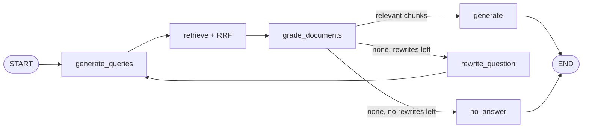

# rag-agent

A question-answering system over 10 research papers on RAG and LLM post-training, built with LangGraph.
It compares three retrieval pipelines, evaluates them with an LLM judge and evidence-level retrieval metrics,
and traces each retrieval failure to its cause.

**Main finding:** multi-query rewriting and CRAG-style grading made no clear difference in this setup. The bottleneck is
**ranking**: the baseline retriever puts the evidence chunk in the top 5 for only 50% of held-out questions,
but in the top 20 for 75%. Both techniques only work with the top 5 chunks, so they never reach the
evidence chunks ranked 6–20.

---

## Pipelines

Three configurations of one LangGraph graph (`rag_graph.py`, `build_graph(multi_query, crag)`):

| Config | What it does |
|---|---|
| `baseline` | Embed the question, retrieve the top 5 chunks, answer with citations |
| `multi_query` | An LLM writes 4 alternative queries; retrieve for all 5 queries in parallel and fuse the results with Reciprocal Rank Fusion (k=60) into the top 5 |
| `mq_crag` | `multi_query` + an LLM grader that drops irrelevant chunks. If none are left, rewrite the query once and search again; if still none, return a fixed "not found" answer |



*(`mq_crag` shown. `baseline` is START → retrieve → generate → END.)*

Design choices:
- The grader always judges chunks against the **original** question, not the rewritten query, so rewriting cannot drift the topic.
- The "not found" answer is set by code (`NO_ANSWER`), not left to the model.
- `MAX_REWRITES = 1` bounds cost and latency.

## Corpus and index

10 papers (PDFs not committed; download them into `data/` with these file names):

| File | Paper |
|---|---|
| `rag_lewis.pdf` | Lewis et al., Retrieval-Augmented Generation for Knowledge-Intensive NLP Tasks ([arXiv 2005.11401](https://arxiv.org/abs/2005.11401)) |
| `self_rag.pdf` | Asai et al., Self-RAG ([arXiv 2310.11511](https://arxiv.org/abs/2310.11511)) |
| `crag.pdf` | Yan et al., Corrective Retrieval Augmented Generation ([arXiv 2401.15884](https://arxiv.org/abs/2401.15884)) |
| `raptor.pdf` | Sarthi et al., RAPTOR ([arXiv 2401.18059](https://arxiv.org/abs/2401.18059)) |
| `hyde.pdf` | Gao et al., Precise Zero-Shot Dense Retrieval without Relevance Labels ([arXiv 2212.10496](https://arxiv.org/abs/2212.10496)) |
| `lora.pdf` | Hu et al., LoRA ([arXiv 2106.09685](https://arxiv.org/abs/2106.09685)) |
| `qlora.pdf` | Dettmers et al., QLoRA ([arXiv 2305.14314](https://arxiv.org/abs/2305.14314)) |
| `dpo.pdf` | Rafailov et al., Direct Preference Optimization ([arXiv 2305.18290](https://arxiv.org/abs/2305.18290)) |
| `instructgpt.pdf` | Ouyang et al., Training language models to follow instructions with human feedback ([arXiv 2203.02155](https://arxiv.org/abs/2203.02155)) |
| `llm_as_judge_mtbench.pdf` | Zheng et al., Judging LLM-as-a-Judge with MT-Bench and Chatbot Arena ([arXiv 2306.05685](https://arxiv.org/abs/2306.05685)) |

Index (`index.py`): one document per PDF page → `RecursiveCharacterTextSplitter` (1000 chars, 150 overlap) →
1129 chunks → `text-embedding-3-small` (512 dims) → Chroma, persisted to `chroma_db/`.
Each chunk keeps `paper`, `page` (0-based) and `start_index` metadata.

Models: `gpt-4o-mini` for query generation, grading, rewriting and answering; `gpt-4o` as the evaluation judge.

## Setup

```bash
uv sync
echo "OPENAI_API_KEY=sk-..." > .env      # never commit .env
# put the 10 PDFs in data/
uv run python index.py                   # builds chroma_db/ on first run
uv run python rag_graph.py               # demo questions
```

## Evaluation

### Question set (`questions.json`)

16 hand-written questions, each with a reference answer, key points, source papers and short **evidence
snippets** (verbatim sentences from the paper that support the answer):

| Type | Count | Example |
|---|---|---|
| factual | 4 | On average, how many bits per parameter does QLoRA's double quantization save? |
| conceptual | 6 | How does HyDE decompose dense retrieval? |
| comparison | 4 | How does CRAG differ from conventional RAG? |
| unanswerable | 2 | How does GRPO estimate advantages without a learned value model? (not in the corpus) |

Two questions (q10, q16) were used while building the pipeline and are marked `dev: true`.
**Headline numbers are on the 14 held-out questions.**

`check_questions.py` verifies, without API calls, that every source exists, every evidence snippet really
appears in its paper, and the keywords of unanswerable questions appear nowhere in the corpus.

### Metrics (`evaluate.py`)

| Metric | Meaning |
|---|---|
| `retrieval_hit` | A required source **paper** is among the chunks passed to the answer step |
| `evidence_hit_pre` | An evidence snippet is in the chunks retrieved **before** CRAG grading |
| `evidence_hit` | An evidence snippet is in the chunks passed to the answer step |
| `coverage` | Fraction of key points the answer covers (gpt-4o judge, one yes/no call per key point) |
| `false_refusal` | The system declined an answerable question |
| `abstained` | The system declined an unanswerable question (higher is better) |
| `latency` | Seconds per question |

`evidence_hit_pre = True, evidence_hit = False` would mean the CRAG grader dropped the right chunk.
Each question runs twice per config (`N_RUNS = 2`) because the pipeline is not deterministic.

### Results

**Held-out questions (dev excluded; 12 answerable + 2 unanswerable, 2 runs each)**

| config | retrieval_hit | evidence_hit_pre | evidence_hit | coverage | false_refusal | abstained | latency (s) |
|---|---|---|---|---|---|---|---|
| baseline | 1.000 | 0.500 | 0.500 | 0.597 | 0.083 | 1.0 | 2.3 |
| multi_query | 1.000 | 0.417 | 0.417 | 0.608 | 0.083 | 1.0 | 4.7 |
| mq_crag | 0.917 | 0.458 | 0.458 | 0.583 | 0.125 | 1.0 | 10.6 |

**Coverage by question type (all questions, including dev)**

| config | factual (4) | conceptual (6) | comparison (4) |
|---|---|---|---|
| baseline | 0.750 | 0.625 | 0.448 |
| multi_query | 0.750 | 0.507 | 0.604 |
| mq_crag | 0.750 | 0.562 | 0.562 |

What the numbers say:
- **No overall gain.** Held-out coverage is 0.58–0.61 for all three configs, while latency grows 2x (multi_query) and 4.5x (mq_crag).
- **Paper-level hit is misleading.** `retrieval_hit` is 1.0 for baseline, but the evidence chunk reaches the answer step for only half of the questions.
- **Multi-query fusion can push the evidence out of the top 5.** Baseline's own query is one of the five fused queries, yet `evidence_hit` drops from 0.500 to 0.417: RRF promotes chunks that several rewritten queries agree on, which are not always the evidence chunk.
- **The one repeated signal is comparison questions.** Multi-query coverage was higher than baseline in both full runs (0.604 vs 0.448 here, 0.635 vs 0.417 in the previous run), consistent with the query prompt asking for one query per compared method. With 4 questions this is a lead, not a result.
- **mq_crag's lower `retrieval_hit`** comes from q07, where CRAG returns the fixed "not found" answer, so no chunks reach the answer step.

Run-to-run noise: between two full runs, the same config's held-out coverage moved by up to ~0.04
(multi_query: 0.642 → 0.608). With 12 answerable held-out questions, one question is 8.3 points of any
rate metric, so small gaps between configs are not conclusive.

### Recall@k diagnostic (`recall_at_k.py`)

Search with the raw question, find the rank of the first chunk that contains an evidence snippet,
and report the fraction of questions with rank ≤ k. Embedding calls only, no LLM.

| subset | @1 | @3 | @5 | @10 | @20 | @30 |
|---|---|---|---|---|---|---|
| all answerable (14) | 0.143 | 0.214 | 0.429 | 0.571 | 0.714 | 0.857 |
| held-out (12) | 0.167 | 0.250 | **0.500** | 0.667 | **0.750** | 0.833 |

Evidence rank per question: q03 1, q06 1, q12 3, q08 4, q11 4, q05 5, q02 6, q04 6, q13 14, q10 15,
q16 23, q01 29, q07 >30, q09 >30.

The pipelines pass 5 chunks to the answer model, so every question ranked 6–30 is lost before
multi-query fusion or CRAG grading can help. This is why neither technique improved retrieval.

## Failure analysis

**1. Question wording (q07, Q-BLEU).** The evidence chunk exists, but its rank depends strongly on the wording:

| Query | Rank of evidence chunk |
|---|---|
| In the original RAG paper by Lewis et al., what is the Q-BLEU metric? (eval question) | >30 |
| What is Q-BLEU? | 12 |
| Q-BLEU metric variant of BLEU matching entities | 6 |

The paper reference ("original RAG paper by Lewis et al.") pulls the query vector toward chunks about RAG in
general; it should be a metadata filter (`paper == rag_lewis`), not part of the semantic query. Even a
keyword-dense query only reaches rank 6, because the Q-BLEU sentence is a small part of a chunk about other
topics. A rare term like "Q-BLEU" is what BM25 matches well.

**2. CRAG rewriting kept the bad part of the query (q07).** The grader correctly rejected all 5 chunks, but the
rewriter produced `Q-BLEU metric definition in RAG paper Lewis et al.`, keeping the phrase that hurt
retrieval. The second search failed the same way, and the system returned the fixed "not found" answer.
An honest refusal, but not a fix.

**3. The CRAG grader never dropped an evidence chunk.** `evidence_hit_pre == evidence_hit` for every config. When
evidence was missing, it was because retrieval never found it, not because the grader removed it.

**4. The grader is lenient on off-topic questions (q14, GRPO).** In both runs it kept a DPO chunk as "relevant", so the
pipeline skipped `no_answer` and went to `generate`. The answer model still declined, so `abstained` stayed 1,
but the deterministic fallback did not trigger. The grading prompt accepts partial relevance.

**5. Answers stay grounded even when the evidence chunk is missed (q05, q09).** Conceptual questions had low
evidence hit but coverage around 0.5–0.6, which could mean the answer model was using its own knowledge.
Inspecting answers against the retrieved chunks showed it was not:
- q09: the answer described reflection tokens from the retrieved chunks but did **not** add the retrieval /
  critique token split, which was only in a chunk that was not retrieved (coverage 1/3).
- q05: the answer said HyDE splits retrieval into "NLU and NLG tasks". This phrasing is in the paper
  (`hyde p.1`, start 1764); the more specific description is in the **adjacent** chunk (start 922),
  which was not retrieved.

**6. PDF extraction noise.** Figure text is indexed as body text (e.g. `hyde p.1` start 0 mixes example queries
about wisdom teeth, COVID-19 and Korean text from Figure 1). Math is garbled (`W0 2 Rd k`), and some spaces
or ligatures are lost (`training,W0`, `forB`), which also constrains which evidence snippets can be matched.

### Annotation changes after inspection

Some facts appear in several places in a paper (e.g. both the abstract and the method section), while the
evidence originally listed only one location. After inspecting retrieval failures we added evidence for the
additional locations in q04 (the low-rank update and frozen weights, not only the initialization) and q05 (the
abstract). We chose them by reading the chunk text, not by retrieval rank, and added one snippet per key point.
Evidence-level hit is therefore still a **lower bound**: a chunk that states the answer in other words is not counted.

## Known limitations

- Small question set (12 answerable held-out questions); differences between configs are within noise.
- The judge is an LLM (gpt-4o); verdicts were not systematically checked by hand.
- When CRAG rewrites, `retrieved_documents` keeps only the last search round.
- An evidence snippet split across two chunks cannot be matched (snippets are kept short, 8–15 words, to reduce this).
- Citations are page-level (`[paper, p.N]`), so they do not say which chunk on a page was used.

## Next steps

Each one targets a failure seen above:

| Failure | Fix |
|---|---|
| Evidence ranked 6–20 (q02, q04, q10, q13) | Retrieve top 20, rerank with a cross-encoder, keep top 5 |
| Adjacent chunk retrieved instead of the evidence chunk (q05) | Expand each hit with its neighbouring chunks (parent-document / window retrieval) |
| Evidence ranked >30, rare terms (q07, q09) | Hybrid retrieval: BM25 + vector search, fused with RRF |
| Paper names inside the query (q07) | Query structuring: extract the paper as a metadata filter |
| Figure text in the index | Detect and drop figure / table regions when parsing PDFs |

q07 motivated the BM25 and query-structuring ideas, so if those are added, q07 should be moved to `dev`.

## Files

| File | Purpose |
|---|---|
| `index.py` | Load PDFs, split, embed, build / load the Chroma store |
| `rag_graph.py` | LangGraph pipelines (`build_graph(multi_query, crag)`) |
| `questions.json` | Evaluation questions with key points and evidence |
| `check_questions.py` | Offline sanity checks for `questions.json` |
| `evaluate.py` | Runs all configs, LLM judge, writes `results/eval_results.json` |
| `recall_at_k.py` | Recall@k of the baseline retriever, writes `results/recall_at_k.json` |
| `diagnostics/debug_evidence.py` | Is an evidence snippet inside one chunk, and where does it rank? |
| `diagnostics/show_chunks.py` | Print all chunks of one page |
| `diagnostics/inspect_answers.py` | Print retrieved chunks and answers for chosen questions |

Run diagnostics from the project root: `uv run python -m diagnostics.debug_evidence`
